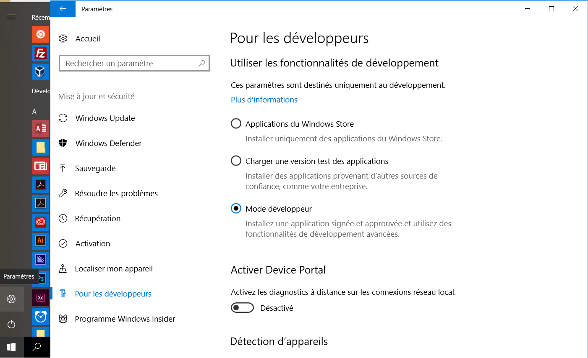
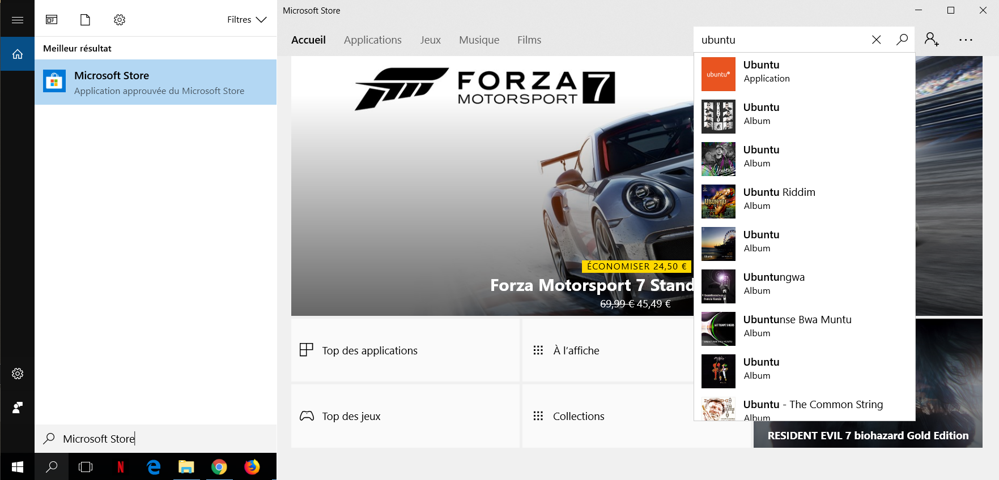
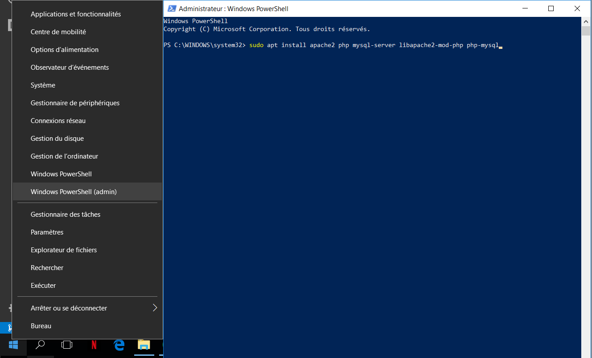

# Utiliser bash linux embarqué sur windows

## Pré-recquis
- Avoir l'OS windows 10 installé
- Avoir l'accès administrateur

## Configuration
Allez dans les ``paramètres`` et cocher ``Mode développeur``  


__Redémarrer l'ordinateur__

Allez dans le ``Microsoft Store`` et installer ``ubuntu``  


Faites clic droit sur le symbole windows et lancer ``Windows Powershell (admin)`` afin d'activer la ``fonctionnalité windows`` : ``"sous système linux"``  

``` bash windows
sudo apt install apache2 php mysql-server libapache2-mod-php php-mysql
```

__Redémarrer l'ordinateur__

> Mise à jour de linux
``` bash linux on windows
apt update
```
``` bash linux on windows
apt upgrade
```

``` bash linux on windows

```

``` bash linux on windows

```

``` bash linux on windows

```

``` bash linux on windows

```

``` bash linux on windows

```

``` bash linux on windows

```

``` bash linux on windows

```